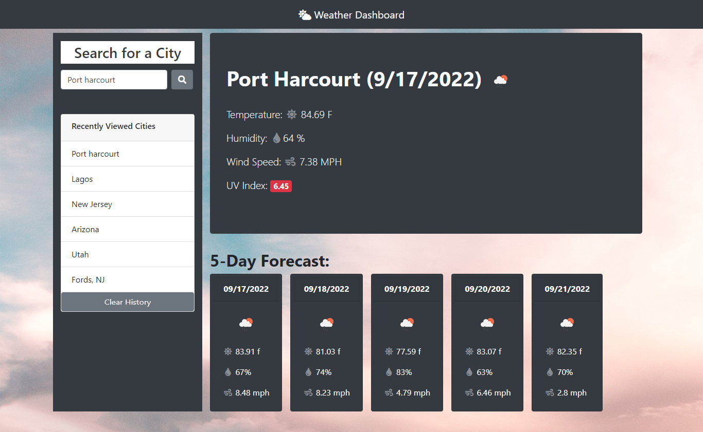

# Weather-Dashboard

# weather-board

Developed a graphical user interface (GUI) that is powered by the [OpenWeather API] (https://openweathermap.org/api), which allows users to retrieve weather information for specific cities. Utilizes 'localStorage' to keep track of any cities that have been looked up in the past, and gives the user the ability to quickly access them again.

# GUI dashboard

 


## User Story

```
AS A traveler
I WANT to see the weather outlook for multiple cities
SO THAT I can plan a trip accordingly
```

## Acceptance Criteria

```
GIVEN a weather dashboard with form inputs
WHEN I search for a city
THEN I am presented with current and future conditions for that city and that city is added to the search history
WHEN I view current weather conditions for that city
THEN I am presented with the city name, the date, an icon representation of weather conditions, the temperature, the humidity, the wind speed, and the UV index
WHEN I view the UV index
THEN I am presented with a color that indicates whether the conditions are favorable, moderate, or severe
WHEN I view future weather conditions for that city
THEN I am presented with a 5-day forecast that displays the date, an icon representation of weather conditions, the temperature, and the humidity
WHEN I click on a city in the search history
THEN I am again presented with current and future conditions for that city
```


## Live application link

https://trebligony.github.io/weather-board/


 
